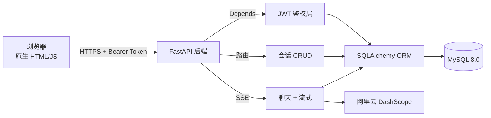
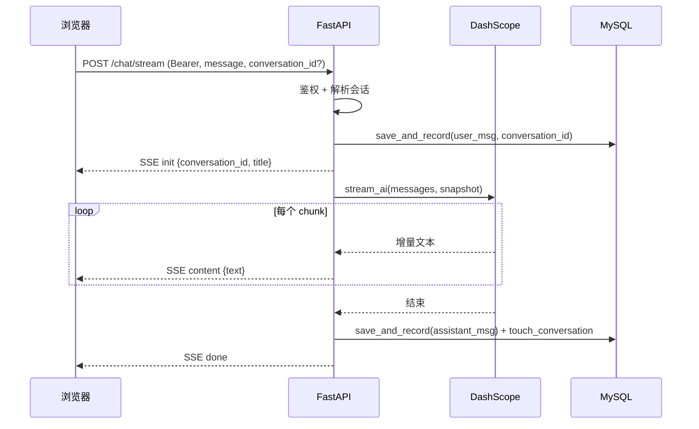

<div align="center">

# 🤖 AI 聊天助手

**一个用 FastAPI + 通义千问从零搭建的多用户 AI 对话服务 —— 带 JWT 认证、持久化上下文记忆、完整 REST API 和 SSE 流式输出。**

[](LICENSE)
[](https://www.python.org/)
[](https://fastapi.tiangolo.com/)
[](https://www.mysql.com/)
[](https://dashscope.aliyun.com/)

[功能](#-主要特性) ·
[快速开始](#-快速开始) ·
[架构](#-架构设计) ·
[API](#-api-接口) ·
[已知限制](#-已知限制) ·
[路线图](#-路线图)

</div>

---

## ✨ 主要特性

- **前后端分离** —— FastAPI 后端 + 原生 HTML/CSS/JS 前端，跨域已配置
- **多用户隔离** —— JWT 鉴权 + 数据访问层强制 `user_id` 过滤，每个用户只能看到自己的会话
- **多会话管理** —— 每个用户可建多个独立会话，互不串台，带新建/重命名/删除
- **混合式上下文记忆** —— 进程内 LRU 滑动窗口（最近 20 轮） + MySQL 持久化回填，热路径零 IO
- **SSE 流式输出** —— 边生成边推送，首字延迟从 3-10 秒降到 < 500ms；支持中途"停止生成"
- **结构化响应** —— 统一 `{code, message, data}` 三段式响应契约，配合 Pydantic 入参校验
- **自动文档** —— FastAPI 自动生成 Swagger UI / ReDoc，开箱即用
- **轻量 schema 演进** —— 启动时自动给老库补缺失列与索引（避免 Alembic 重型工具）

## 🛠️ 技术栈

| 层级 | 技术 | 说明 |
|------|------|------|
| 后端框架 | FastAPI 0.135+ | 异步、依赖注入、自动 OpenAPI 文档 |
| ASGI 服务器 | Uvicorn 0.44+ | 支持 HTTP/1.1 + WebSocket |
| AI 服务 | DashScope SDK 1.25+ | 阿里云官方，通义千问 Qwen 系列模型 |
| 数据库 ORM | SQLAlchemy 2.0+ | 关系映射 + 连接池预检 |
| 数据库 | MySQL 8.0 | utf8mb4 字符集 |
| 认证 | python-jose + bcrypt | JWT (HS256) + bcrypt 加盐哈希 |
| 数据校验 | Pydantic 2.x | 入参约束、EmailStr |
| 前端 | 原生 HTML/CSS/JS | 无框架依赖，ReadbleStream + AbortController |

## � 快速开始

### 环境要求

- Python 3.11+
- MySQL 8.0+
- 阿里云 DashScope API Key（[免费申请](https://dashscope.console.aliyun.com/)）

### 1. 克隆与安装

```bash
git clone https://github.com/23iho/ai-chat-assistant.git
cd ai-chat-assistant

cd backend
python -m venv .venv
# Windows
.venv\Scripts\activate
# Linux/Mac
source .venv/bin/activate

pip install -r requirements.txt
```

### 2. 配置环境变量

```bash
cp .env.example .env
```

编辑 `backend/.env`，至少填这几项：

```env
# 阿里云 DashScope
DASH_SCOPE_API_KEY=sk-xxxxxxxxxxxxxxxxxx
QWEN_MODEL=qwen-turbo

# MySQL
DB_HOST=127.0.0.1
DB_PORT=3306
DB_USER=root
DB_PASSWORD=your_password
DB_NAME=ai_chat_db

# JWT（生产环境务必改成随机长字符串）
JWT_SECRET=change-me-to-a-random-64-char-string
JWT_ALGORITHM=HS256
JWT_ACCESS_TOKEN_EXPIRE_MINUTES=1440
```

### 3. 准备数据库

```sql
CREATE DATABASE ai_chat_db CHARACTER SET utf8mb4 COLLATE utf8mb4_unicode_ci;
```

首次启动会自动建表（`users` / `chat_records` / `conversations`），老库会自动补缺失列。

### 4. 启动

**后端**（终端 1）：

```bash
cd backend
python main.py
# 监听 http://localhost:8000
```

**前端**（终端 2）：

```bash
cd frontend
# Windows
start.bat
# 通用
python -m http.server 8080
```

浏览器打开 <http://localhost:8080>，注册账号即可使用。

## 📁 项目结构

```
ai-chat-assistant/
├── backend/
│   ├── main.py              FastAPI 路由（8 个端点 + 流式 SSE）
│   ├── ai_service.py        Qwen 调用（阻塞 call_ai + 流式 stream_ai）
│   ├── auth.py              JWT 签发 / 校验 / get_current_user
│   ├── database.py          SQLAlchemy 模型 + CRUD + ensure_schema()
│   ├── requirements.txt     依赖锁定
│   ├── .env.example         环境变量示例
│   └── .gitignore
├── frontend/
│   ├── index.html           单页应用（含样式）
│   ├── css/style.css        旧样式文件（已被 index.html 内联样式取代）
│   ├── js/app.js            前端逻辑（约 600 行）
│   └── start.bat            Windows 启动脚本
├── LICENSE                  MIT
└── README.md                本文件
```

## 🏗 架构设计

### 组件关系



### 请求时序（SSE 流式对话为例）



### 关键设计取舍

1. **为什么用混合式上下文（内存 + DB）？**
   - 纯内存：重启即丢，体验差；多 worker 命中率下降
   - 纯 DB：每轮多一次 IO，延迟高
   - 混合：热路径（已在聊的会话）零 IO；冷路径（重启 / 切会话）从 DB 回填，< 100ms 完成
2. **为什么用 `(user_id, conversation_id)` 作缓存 key？**
   - 用户在不同会话间切换时，避免上下文串台（比如聊完 Python 再问菜谱）
3. **为什么 SSE 而不是 WebSocket？**
   - SSE 单向（服务端推）刚好匹配 LLM 输出场景；HTTP 兼容好、断线重连浏览器原生支持；部署不需要额外协议
   - 真要双向（多设备同会话同步）再升级到 WebSocket + Redis Pub/Sub

## 📖 API 接口

启动后端后访问：

- **Swagger UI**：<http://localhost:8000/docs>
- **ReDoc**：<http://localhost:8000/redoc>

### 接口一览

|  方法  | 路径                       | 说明                       | 需登录 |
|--------|----------------------------|----------------------------|--------|
| GET    | `/`                        | 健康检查                   | ❌     |
| POST   | `/register`                | 用户注册                   | ❌     |
| POST   | `/login`                   | 用户登录（业务用）         | ❌     |
| POST   | `/login/oauth`             | OAuth2 登录（Swagger 用）  | ❌     |
| GET    | `/users/me`                | 当前用户信息               | ✅     |
| POST   | `/chat`                    | 阻塞式聊天（演示 / 测试）  | ✅     |
| POST   | `/chat/stream`             | **SSE 流式聊天**（推荐）   | ✅     |
| GET    | `/conversations`           | 列出我的会话               | ✅     |
| POST   | `/conversations`           | 新建会话                   | ✅     |
| PATCH  | `/conversations/{id}`      | 重命名会话                 | ✅     |
| DELETE | `/conversations/{id}`      | 删除会话（级联删消息）     | ✅     |
| GET    | `/history`                 | 查询聊天记录（可按会话过滤）| ✅     |
| DELETE | `/history`                 | 清空聊天记录（可按会话过滤）| ✅     |

### 示例：SSE 流式对话

```bash
curl -N -X POST http://localhost:8000/chat/stream \
  -H "Authorization: Bearer YOUR_JWT" \
  -H "Content-Type: application/json" \
  -d '{"message": "用一句话介绍你自己", "conversation_id": null}'
```

服务端会逐 chunk 推送：

```
data: {"type": "init", "conversation_id": 42, "conversation_title": "用一句话介绍你自己"}

data: {"type": "content", "text": "我是"}

data: {"type": "content", "text": "通义千问"}

data: {"type": "content", "text": "，由阿里云开发的大语言模型。"}

data: {"type": "done"}
```

## �️ 已知限制

> 主动暴露缺陷比掩盖更可信。下面这些是当前实现的边界，也是后续演进的入口。

1. **进程内上下文缓存**
   - 单进程内存，重启即丢（下次访问会从 DB 自动回填，< 100ms）
   - 多 worker 部署下命中率下降（每个 worker 各自一份内存）
   - **正确解法**：迁移到 Redis Hash + TTL（`README` 路线图有列）
2. **JWT 无主动失效机制**
   - 当前登出只是前端删 token，后端不感知
   - 正确解法：jti + Redis 黑名单 + Refresh Token
3. **没有限流与配额**
   - 公网部署有 API Key 被刷爆的风险
   - 正确解法：slowapi + Redis 令牌桶按用户 QPS 限流 + 每日 token 配额
4. **进程内 SSE 与 DB session 生命周期**
   - 客户端中途断流时，最后一段 AI 文本可能未落库（用户消息已落库）
   - 影响极小（用户主动取消 = 反正不要这回复），但要心里有数
5. **没有 WebSocket / 多设备同步**
   - 当前是单机对话流，多设备同时打开同一会话看到的是各自状态
   - 路线图里有 WebSocket + Redis Pub/Sub 计划

## � 路线图

### 已完成 ✅

- [x] 用户注册 / 登录 / JWT 鉴权
- [x] 多用户数据隔离
- [x] 上下文记忆（混合式：内存窗口 + DB 回填）
- [x] 聊天记录 CRUD
- [x] SSE 流式输出 + 停止生成
- [x] 多会话管理（新建 / 重命名 / 删除 / 切换）
- [x] 自动 schema 演进（`ensure_schema()`）
- [x] 连接池预检（`pool_pre_ping`）
- [x] 修复 4 个 P0 Bug（上下文方向、异常吞噬、XSS、内存 dict 无界）

### 进行中 🚧

- [ ] Dockerfile + docker-compose 一键部署
- [ ] 在线 Demo（Railway + Vercel）
- [ ] pytest 基础测试 + GitHub Actions CI
- [ ] Markdown 渲染 + 代码高亮

### 计划中 📋

- [ ] Redis 上下文迁移（替换进程内 dict）
- [ ] Refresh Token + 黑名单
- [ ] Token 用量统计 + 成本看板
- [ ] 限流 + 配额 + 内容审核
- [ ] 多模型切换 + 参数面板
- [ ] System Prompt / 角色预设
- [ ] 轻量 RAG（PDF 文档问答）
- [ ] Function Calling / Tool Use
- [ ] 前端 Vue 3 + Vite + TypeScript 重构
- [ ] Sentry 错误监控 + Prometheus 指标

## 🤝 贡献

欢迎提 Issue 和 PR。本项目以学习交流为目的，功能建议和 bug 反馈都可以。

## 📄 License

[MIT](LICENSE) © 2026 [23iho](https://github.com/23iho)
